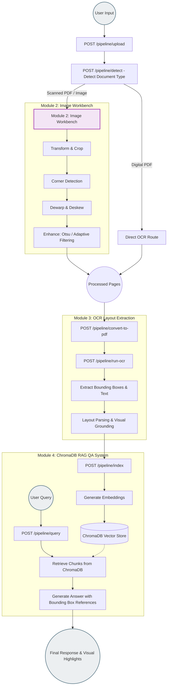

# Project Akshar Complete Workflow (Actual State)

Here is the flowchart representing the *actual* implemented workflow of the Project Akshar AI document processing system based on the current codebase. 

The pipeline orchestrator automatically routes documents either to the Image Workbench (Module 2) or directly to OCR, depending on whether they are scanned or digital.

### Module Breakdown
- **Module 2 (Image Workbench)**: Handles all scanned documents and images. Offers interactive transformations, smart corner detection, dewarping, deskewing, and image enhancement.
- **Module 3 (OCR & Layout)**: Performs OCR to extract text and bounding boxes for visual grounding. Digital PDFs go straight here.
- **Module 4 (RAG QA)**: Embeds the OCR output into a ChromaDB vector store for answering user queries with bounding-box citations.
